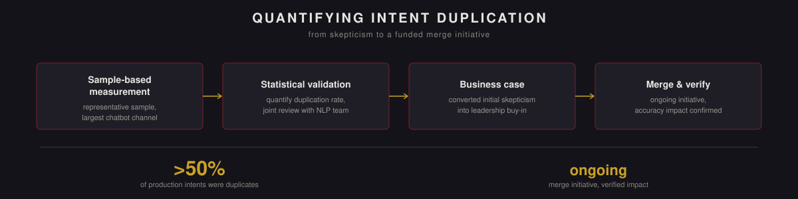

  

<a href="README.ru.md">Русская версия →</a>

# Duplicate Intent Analysis for Chatbots

> **Note on source code and scope.** This repository documents methodology, design decisions, and results only; the implementation is proprietary to the employer and not published here. This was a collaborative project with the NLP team, since intent duplication directly affects class separability, which falls within their domain. The quantitative analysis, statistical validation, and business case described here were led by the author.

Business leadership didn't initially see the need to merge duplicate chatbot intents. This project replaced that skepticism with a single, hard-to-argue-with number — and turned into an active initiative that's still improving intent accuracy today.

## At a glance

| | |
|---|---|
| **Duplication rate found** | over 50% of production intents on the channel measured |
| **Scope** | the largest chatbot channel, measured on a representative sample |
| **Status** | merge initiative ongoing; accuracy improvement verified in practice |

## Problem

Duplicate intents across chatbot systems were quietly causing several compounding problems: lower model accuracy, missed automation opportunities in production, unclear prioritization because the same underlying intent existed in multiple places, and reduced effectiveness for both classifiers and LLMs trying to work with an ambiguous intent structure. None of this was disputed once explained — but without a number attached to it, leadership didn't see it as urgent enough to act on.

## Approach

**Finding candidate duplicates.** Chats that failed to automate were annotated by reason — specifically, cases marked "intent belongs to another bot" or "no matching bot exists" — and for each, potential matching intents were identified.

**Quantifying the overlap.** Using a representative sample from the largest chatbot channel, the analysis calculated the proportion of chats that could plausibly map to more than one bot. That proportion is the duplication rate.

**Validation.** Findings were checked statistically against the sample before being presented, and reviewed jointly with the NLP team given the direct link between intent duplication and how separable the resulting classes are for a classifier.

**Key metrics tracked:** duplication percentage, coverage of automated responses, and the downstream impact on intent accuracy and classifier performance.

## Results

- Found that over 50% of production intents on the measured channel were duplicates — a figure precise and striking enough to change leadership's view of the problem.
- The duplicate-merging initiative it justified is ongoing, and its improvement to intent accuracy has been verified in practice, not just assumed.
- Side effects turned out to matter almost as much as the headline number: clearer intent mapping, a smoother day-to-day workflow, and a more effective classifier as a direct result of reduced ambiguity.

## Business impact

- Increased automation and processing speed by removing the ambiguity duplicate intents had introduced.
- Improved intent accuracy and overall model performance.
- Positive, measurable effect on classification metrics and team productivity.
- Indirectly improved user satisfaction and product quality by resolving a structural issue rather than patching around it.

## Tech stack

Python · pandas · statistical analysis

---

Collaborative project with the NLP team (intent duplication affects class separability, their area of ownership); the quantitative analysis and business case described here were led by the author. Production code is not publicly available.
